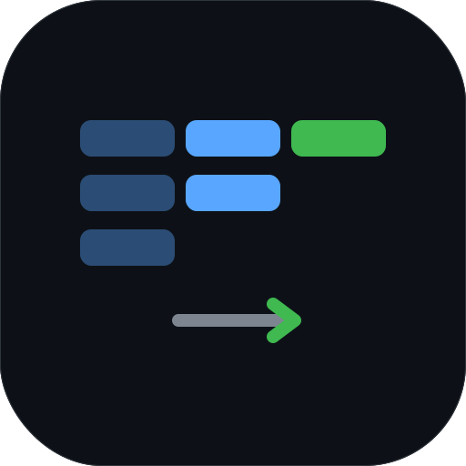
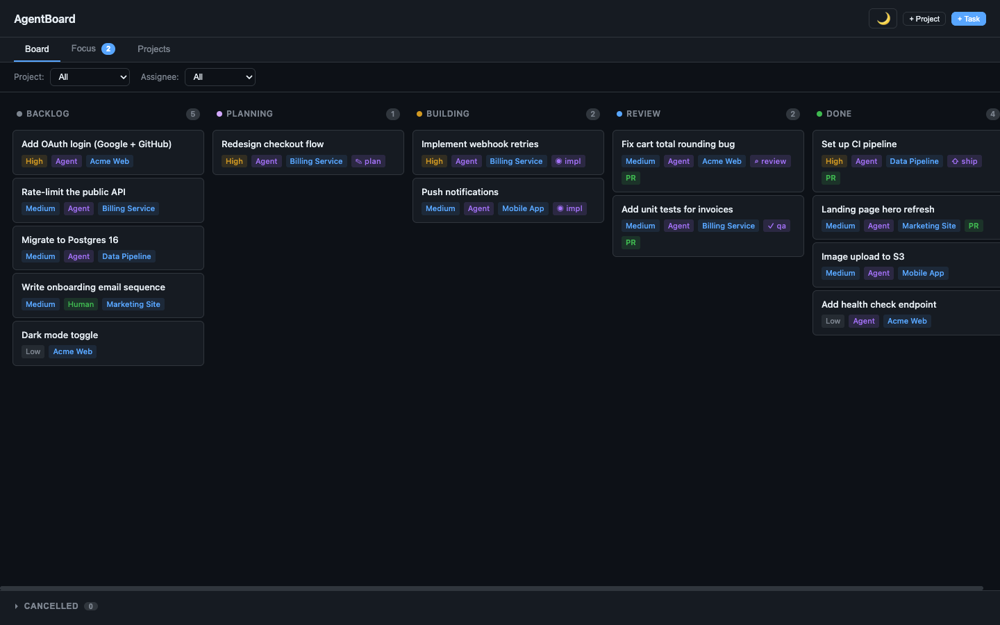
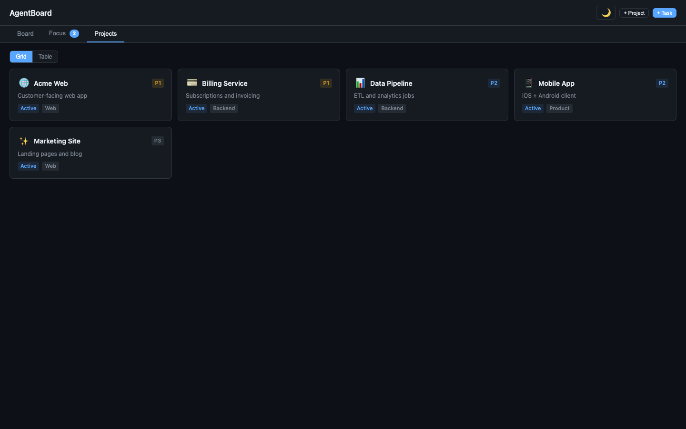
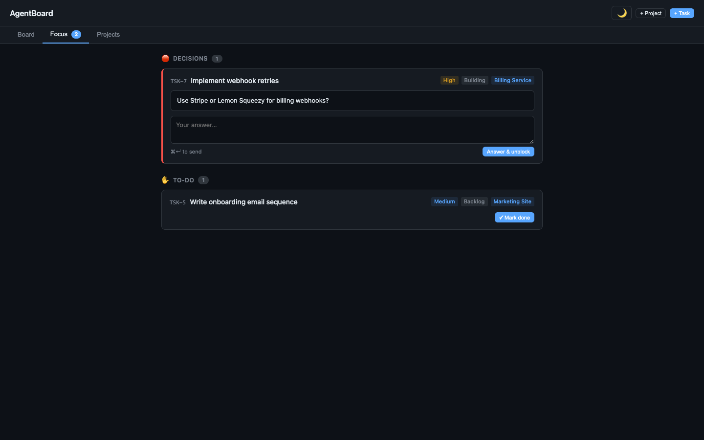

<div align="center">
  
  <h1>AgentBoard</h1>
  <p><strong>A shared kanban board for you and your AI coding agents.</strong></p>
  <p>
    
    
    
  </p>
</div>

---

AgentBoard is a self-hosted task board built for the way people actually work with coding
agents now: you queue up work, agents pick it up, and everyone — human and agent — watches the
same board update in real time.

Agents don't just read the board. An agent runs `ab claim <id>` and AgentBoard atomically
moves the task to **Planning**, creates an isolated **git worktree** for it, and drops a context
file the agent reads on startup. Multiple agents can chew through the backlog in parallel without
stepping on each other's branches. When an agent hits a decision it can't make alone, it flags the
task to your **Focus** queue and keeps moving.



## Why

Coding agents are good at execution and bad at coordination. Issue trackers are built for humans
filing tickets, not for agents claiming work, isolating their changes, and asking for help. AgentBoard
is the thin layer in between:

- **One board, two kinds of worker.** Humans drag cards; agents drive the same board over a CLI / MCP.
- **Parallelism without collisions.** Claiming a task creates a per-task git worktree — agents never share a working tree.
- **Decisions come to you.** Agents push blockers and hand-offs to a Focus queue instead of guessing or stalling.
- **You own it.** Self-hosted, SQLite, runs behind Tailscale on a box you control. No SaaS, no per-seat pricing.

## Features

- **Kanban pipeline** — `Backlog → Planning → Building → Review → Done` (+ `Cancelled`), with a finer
  `pipeline_stage` sub-marker (`design · plan · impl · review · ship · qa`).
- **Focus queue** — a single place for everything waiting on a human: agent decisions (`ab block`) and tasks assigned to you.
- **Projects** — grid or table view, per-project priority/status/category, custom emoji icons.
- **Notes** — nested wiki pages per project (Milkdown WYSIWYG editor) with `@`-mention cross-page links — for design docs, specs, and decisions.
- **Live updates** — the dashboard streams changes over Server-Sent Events; no refresh, no polling lag.
- **Git worktree automation** — atomic claim → worktree → context file, plus `ab worktree list/gc/remove` housekeeping.
- **PR tracking** — a background poller captures the PR URL for a claimed task within ~30s of the PR opening (needs the `gh` CLI on the host — see limitations).
- **CLI + MCP** — the `ab` CLI for terminal use, and a Model Context Protocol server so agents get first-class tools.

<table>
  <tr>
    <td width="50%"><br/><sub><b>Projects</b> — all your work, grid or table.</sub></td>
    <td width="50%"><br/><sub><b>Focus</b> — agent decisions and to-dos waiting on a human.</sub></td>
  </tr>
</table>

## Quickstart

### Install via SelfStack (recommended)

AgentBoard is in the [SelfStack](https://github.com/Avanderheyde/self-stack) registry, so on a box
running SelfStack it's one command:

```bash
selfstack search agentboard
selfstack install agentboard
```

This pulls the repo, builds the image, and runs it behind your Tailnet on port `3000`.

### Run with Docker Compose

```bash
git clone https://github.com/not0xjarvis/agentboard.git
cd agentboard
docker compose up -d
# open http://localhost:3000  (override the port with SELFSTACK_HOST_PORT)
```

The SQLite database persists in the `data` volume.

> **Heads up:** this publishes port `3000` on all host interfaces with **no authentication** —
> fine behind Tailscale or on a trusted LAN, but on a shared/public network bind it to localhost
> (`127.0.0.1:3000:3000`) or front it with an authenticating reverse proxy.

### Run locally (development)

```bash
git clone https://github.com/not0xjarvis/agentboard.git
cd agentboard

# Terminal 1 — API server on :3000 (also serves the built dashboard in production)
cd server && npm install && DATA_DIR=./data npm start

# Terminal 2 — dashboard dev server on :5173, hot reload, proxies /api to :3000
cd dashboard && npm install && npm run dev
```

In development, open the Vite dev server at `http://localhost:5173` — it proxies `/api` to the
server on `:3000`. (Serving the dashboard directly at `:3000` requires a build first, which is
what the Docker image does.) Confirm the API is up:

```bash
curl http://localhost:3000/api/health   # → {"status":"ok"}
```

## The agent workflow (`ab`)

`ab` is a single-file CLI (`cli/ab.js`) that talks to the AgentBoard API. Point an agent at it and the
board becomes its task system. Make it convenient:

```bash
alias ab="node /path/to/agentboard/cli/ab.js"
export AGENTBOARD_URL=http://localhost:3000   # default
```

A typical loop:

```bash
ab backlog                 # what's available to pick up (priority sorted)
ab claim 42                # atomic claim → Planning, creates git worktree + context file
cd $(ab cd 42)             # jump into the task's worktree
ab next 42                 # the recommended next command for the current state
ab status 42 Building      # transition along the pipeline
ab block 42 "Use Stripe or Lemon Squeezy?"   # flag a decision → lands in your Focus queue
ab comment 42 "API wired, writing tests"
ab done 42 "PR merged, QA green"              # refuses if the worktree is dirty (--dirty to override)
```

Run `ab help` for the full command set (tasks, projects, notes, worktree GC, focus, comments).

## MCP server

For agents that speak the [Model Context Protocol](https://modelcontextprotocol.io), `mcp-server/`
exposes the board as native tools (`list_tasks`, `get_backlog`, `claim_task`, `create_task`,
`update_task`, `add_comment`, `block_task`, `unblock_task`, `list_focus`, project + note tools, …).

Install its dependencies once, then point your agent's MCP config at it:

```bash
cd mcp-server && npm install
```

```jsonc
// e.g. claude_desktop_config.json / your agent's MCP config
{
  "mcpServers": {
    "agentboard": {
      "command": "node",
      "args": ["/path/to/agentboard/mcp-server/index.js"],
      "env": { "AGENTBOARD_URL": "http://localhost:3000" }
    }
  }
}
```

## Architecture

```
┌────────────┐   SSE + REST   ┌──────────────────────┐
│  Dashboard │ ◀───────────── │  Server (Express)    │
│ React+Vite │ ──────────────▶│  + SQLite            │
└────────────┘                │  + PR-URL poller     │
                              ▲│  + SSE broadcaster   │
   ab CLI ───── REST ─────────┘└──────────────────────┘
   MCP server ─ REST ─────────┘
```

| Component      | Path           | What it is                                                              |
| -------------- | -------------- | ---------------------------------------------------------------------- |
| **server**     | `server/`      | Express API + `better-sqlite3`, SSE stream, background PR-URL poller.   |
| **dashboard**  | `dashboard/`   | React 19 + Vite SPA; Milkdown notes editor. Built to `dashboard/dist`. |
| **cli**        | `cli/ab.js`    | Single-file `ab` CLI; the agent/terminal interface.                    |
| **mcp-server** | `mcp-server/`  | MCP wrapper exposing the API as agent tools.                           |

State lives in a single SQLite file under `DATA_DIR` (the `data` Docker volume), so backup and
restore are a file copy.

## Configuration

| Variable             | Default                  | Used by      | Purpose                                  |
| -------------------- | ------------------------ | ------------ | ---------------------------------------- |
| `PORT`               | `3000`                   | server       | API + dashboard port.                    |
| `DATA_DIR`           | `/app/data` (Docker)     | server       | Where the SQLite DB is stored.           |
| `SELFSTACK_HOST_PORT`| `3000`                   | docker-compose | Host port mapped to the container.     |
| `AGENTBOARD_URL`     | `http://localhost:3000`  | cli, mcp     | Where the CLI / MCP server find the API. |

The server binds `0.0.0.0`, so it's reachable across your Tailnet with no extra config.

## Development commands

```bash
# dashboard
cd dashboard && npm run dev      # hot-reload dev server
cd dashboard && npm run build    # production build → dashboard/dist

# server
cd server && npm start           # node index.js
cd server && npm run dev         # node --watch index.js

# health check
curl http://localhost:3000/api/health
```

## SelfStack fit

AgentBoard ships SelfStack-native: [`selfstack.yml`](selfstack.yml) declares the runtime
(`docker-compose`), the exposed port (`3000`), the health endpoint (`/api/health`), and a `data`
volume for the SQLite database. That's everything SelfStack needs to install, health-check, and
manage it alongside your other personal apps behind Tailscale.

## Status & limitations

AgentBoard is used daily by its author but is **pre-1.0** — expect rough edges:

- Single-user / single-tenant by design. There's no auth layer; it assumes a trusted network (Tailscale).
- The PR-URL poller needs the GitHub CLI (`gh`, authenticated) on the host. The stock Docker image doesn't bundle `gh`, so PR tracking is a no-op in a vanilla container until you add it.
- `ab worktree gc` is conservative (dry-run by default) and lightly battle-tested on real >7-day-old merged PRs.
- No external test suite yet; `npm run build` and the `/api/health` smoke check are the current gates.

Contributions and bug reports welcome.
